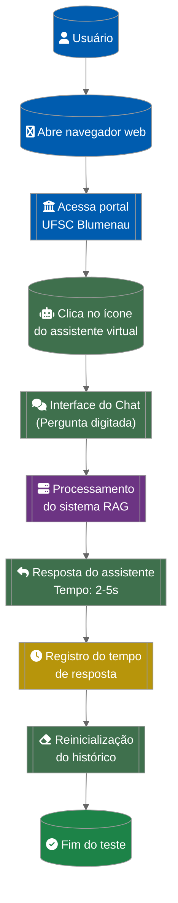

# Fluxo de Interação com o Assistente Virtual Acadêmico

**Legenda de Cores**:
- 🔵 Azul: Passos institucionais
- 🟢 Verde: Interações com o assistente
- 🟣 Roxo: Processamento técnico
- 🟡 Amarelo: Registro de métricas